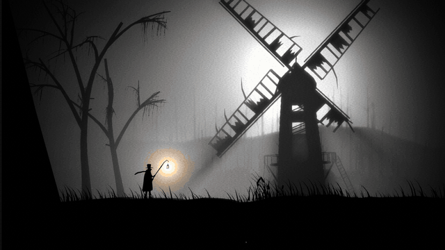
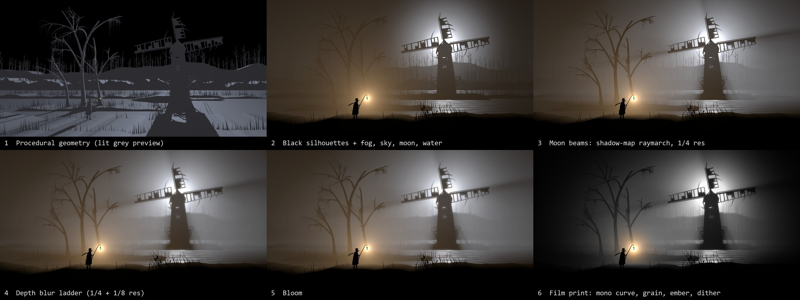
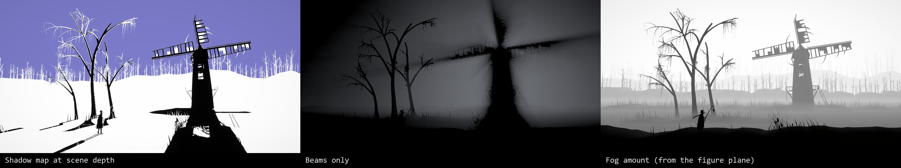
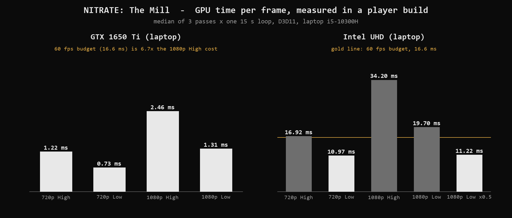
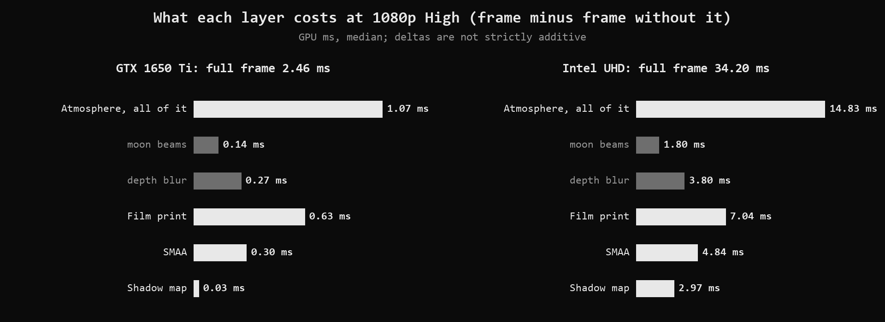

# NITRATE: The Mill



A moonlit silhouette loop rendered in real time in Unity 6 URP. The turning sails of the windmill cut the moonlight on every frame: the light shafts are raymarched through the shadow map, not painted on. All the geometry is generated by code. One black Shader Graph material carries the wind through every pass. A custom Render Graph pipeline adds fog, a depth-blur ladder and a film print.

**2.46 ms per frame at 1080p on a laptop GTX 1650 Ti. 11.0 ms at 720p on the laptop's Intel UHD with the Low preset.** Both measured in a player build (see [Frame budget](#frame-budget)).

**[Download the Windows build (v1.0)](https://github.com/matbcontrol/Nitrate/releases/tag/v1.0)**, run it, and check the numbers on your own GPU with `RunBenchmark.bat`.

## How it works



1. **Geometry.** Generators in `Assets/Nitrate/Scripts/Generators` build every mesh in the editor: ridges with a grass fringe, far ridges with bare trees, trees with hanging moss, reeds, the mill and its sails, the lantern, the rope. The lamplighter is a cut-paper puppet: hand-placed outlines, smoothed and extruded. `Nitrate > 2. Build Mill Scene` rebuilds everything.
2. **Silhouettes.** `Shaders/Graphs/NitrateSilhouette.shadergraph` is unlit black and casts shadows. The wind moves vertices in every pass, shadow caster and depth included, so the shafts blocked by a swaying branch sway with it and depth priming still matches. The generators write the wind response into vertex colour: R is stiffness, G is phase.
3. **Atmosphere.** `Scripts/NitrateAtmosphereFeature.cs` and `Shaders/NitrateAtmosphere.shader`, as Render Graph passes before post-processing:
   - **Beams:** a raymarch through the main light's shadow map at 1/4 resolution. It takes 16 steps with blue-noise jitter that changes at 24 Hz, then runs a depth-aware separable blur and a bilateral upsample.
   - **Composite:**
     - fog measured from the figure's plane, so the figure and everything in front of it stay pure black;
     - an analytic sky and moon;
     - a water mirror whose ripples follow the same gusts as the grass;
     - the lantern's glow in fog, in closed form.
   - **Depth-blur ladder** instead of Bokeh DoF: depth-rejecting blurs at 1/4 and 1/8 resolution, picked per pixel by distance to the figure's plane. The blur works on compressed HDR, `c / (1 + luma)`; without it the moon floods the thin sails.
4. **Film print.** `Shaders/Graphs/NitrateFilm.shadergraph` and `Scripts/NitrateFilmFeature.cs`:
   - a mono tone curve, with saturated warm pixels keeping their colour (the lantern);
   - a vignette, 24 Hz streaky blue-noise grain, flicker, gate weave, dust and scratches;
   - a TPDF dither. The dither needs a 64-bit HDR target, because R11G11B10 quantises it away.
5. **Camera and loop.** A dolly zoom with a physical-camera lens shift keeps the hub on the upper-right thirds point while the field of view goes from 15° to 38° (`Scripts/NitrateDollyZoom.cs`). Everything moves on one 15 s clock, with periods that divide the loop, so the loop has no seam.

`Shaders/NitrateSilhouette.shader` and `Shaders/NitrateFilm.shader` are the same code as the two graphs, written by hand and kept as a readable reference. Rendered side by side, each graph and its shader differ in fewer than 0.01% of the pixels, from floating-point ordering.



## Frame budget



GPU time per frame, median:

| | 720p High | 720p Low | 1080p High | 1080p Low |
|---|---|---|---|---|
| GTX 1650 Ti (laptop) | 1.22 ms | 0.73 ms | 2.46 ms | 1.31 ms |
| Intel UHD, i5-10300H (laptop) | 16.9 ms | 11.0 ms | 34.2 ms | 19.7 ms (11.2 ms at render scale 0.5) |



**Method.**
- Measured in a Windows player build on D3D11, with `FrameTimingManager` GPU times.
- 15 configurations: the full look, plus each layer switched off in turn. A layer's cost is the full frame minus the frame without it, so the deltas are not strictly additive.
- Each configuration plays the whole 15 s loop after a warm-up. The run repeats 3 times in alternating order, and the tables use the median.
- The raw CSVs are in `benchmarks/`.

**What the numbers say.**
- On the GTX the whole look is a small fraction of a 60 fps budget.
- On the Intel UHD the full-screen passes dominate, especially the atmosphere composite at 1080p. The beams, which the scene is built around, cost 0.14 ms on the GTX and 1.8 ms on the UHD.

## Run it

- **Unity 6000.6.4f1** (Unity 6.6) with URP 17.6. Tested on Windows with D3D11.
- Open the project and the scene `Assets/Nitrate/Scenes/Mill.unity`, then press Play. The scene also animates in edit mode (`Nitrate > Animate In Edit Mode`).
- `Nitrate > 1. Configure Project` re-applies the URP and project settings. `Nitrate > 2. Build Mill Scene` regenerates the scene.

**Keys in Play mode:**
- `1` film, `2` bloom, `3` depth blur, `4` beam mode, `5` atmosphere, `6` lit grey view;
- `V` debug views, `L` High/Low preset, `M` lantern colour, `H` HUD;
- mouse wheel: dolly, `Space`: autoplay;
- right mouse drag: move the moon, `C`: cursor.

**Benchmark.**
1. Build the player.
2. Run `Nitrate.exe -benchmark`. The CSV is written next to the exe, and `benchmarks/RunBenchmark.bat` does the same at 1080p fullscreen.
3. Optional flags:
   - `-passes N` and `-measure S` set the number of passes and the seconds per configuration;
   - `-shots <folder>` saves one frame per configuration;
   - Unity's `-force-device-index N` picks the GPU on a laptop with two.

  For showing the scene, run it fullscreen: windowed mode on a two-GPU laptop adds occasional presentation stalls.

## Project layout

```
Assets/Nitrate/
  Scripts/             atmosphere and film features, clock, camera, controls, benchmark
  Scripts/Generators/  mesh builder and the procedural generators
  Shaders/             atmosphere passes, common HLSL, hand-written reference shaders
  Shaders/Graphs/      Silhouette and Film Shader Graphs, custom-function HLSL
  Editor/              project setup, scene builder, verification, blue-noise generator
  Materials/  Scenes/  Textures/  Settings/
benchmarks/            measured CSVs and a benchmark launcher
media/                 images used in this README
```

## Known limitations

- The depth-blur radius is set in texels of the 1/4-resolution target, so at 4K the background looks crisper than at 1080p.
- The GPU Resident Drawer is disabled: it uploads transforms only at frame boundaries, and the offline frame renderer poses the scene in the middle of a frame.
- The blue-noise texture is generated in the editor (void-and-cluster, Ulichney 1993). URP's built-in blue noise is Alpha8, which reads 0 in the red channel.

## License

[MIT](LICENSE)
